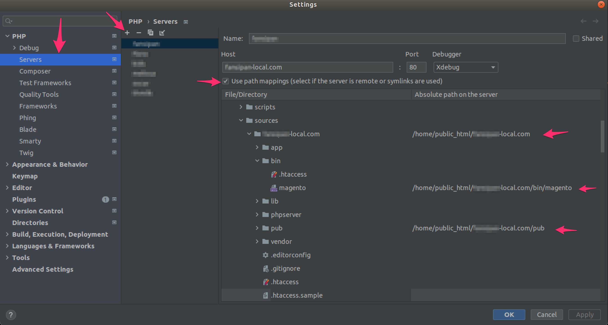

# Table of Contents
- [Table of Contents](#table-of-contents)
- [Introduction](#introduction)
  - [System Requirements](#system-requirements)
    - [System Overview](#system-overview)
      - [System Directory Structure](#system-directory-structure)
      - [Pre-configured Services](#pre-configured-services)
      - [System Commands](#system-commands)
      - [Email Catch All System](#email-catch-all-system)
- [Usage Guide](#usage-guide)
  - [Basic Docker and Docker-Compose Commands](#basic-docker-and-docker-compose-commands)
  - [Using the System](#using-the-system)
    - [Good to know](#good-to-know)
  - [Getting Started](#getting-started)
  - [Data Cleanup](#data-cleanup)
  - [Examples](#examples)
    - [Initializing and Running Nginx, PHP 7.2, MySQL, and Mailhog](#initializing-and-running-nginx-php-72-mysql-and-mailhog)
    - [Adding PHP 7.3](#adding-php-73)
    - [Enabling Xdebug for PHP 7.2](#enabling-xdebug-for-php-72)
    - [Creating a Database with the Name "magento2"](#creating-a-database-with-the-name-magento2)
    - [Importing a Backup File into the "magento2" Database](#importing-a-backup-file-into-the-magento2-database)
    - [Exporting (Backing Up) the "magento2" Database](#exporting-backing-up-the-magento2-database)
    - [Dropping the "magento2" Database](#dropping-the-magento2-database)
    - [Automatically Downloading and Installing Magento](#automatically-downloading-and-installing-magento)
    - [Enabling SSL for a Domain](#enabling-ssl-for-a-domain)
    - [Using Varnish for a Domain](#using-varnish-for-a-domain)
    - [Steps to Run a Magento Site Cloned from Git](#steps-to-run-a-magento-site-cloned-from-git)

# Introduction
Docker-compose combo for Magento with features such as:

* Simultaneously run multiple PHP versions, eliminating the need to create separate docker-compose stacks for different projects. A single docker-compose stack is sufficient.
* Automatically create virtual hosts for Nginx, supporting Magento 1, Magento 2, Laravel, and WordPress.
* SSL support
* Automatically download and install fresh Magento versions as needed.
* Automatically download and install fresh Magento Docker Cloud versions as needed.
* Using `docker-sync` for file syschronization.
* Create/Drop/Import/Export databases from the command line.
* Enable/Disable Xdebug for each PHP version.
* Automatically add domains to /etc/hosts.
* Local email catch-all system to prevent sending emails to the internet (but remember to check the SMTP config for production).
* Support for NVM and Grunt.
* Nginx logs are stored separately in the logs/nginx directory.
* TBU: Magento MFTF Selenium, Localstack (AWS S3), Integrate React front-end with Magento

Currently, it has been tested on Ubuntu, so users of other operating systems may need to adapt.

## System Requirements
* The system requires Docker and Docker-Compose to be installed. To install Docker-Compose, follow the instructions [here](https://docs.docker.com/engine/install/ubuntu/).

```bash
# To install Docker-Compose on Ubuntu
sudo curl -L https://github.com/docker/compose/releases/download/1.28.5/docker-compose-Linux-x86_64 -o /usr/local/bin/docker-compose
chmod +x /usr/local/bin/docker-compose
```

* After installing Docker, run the following command to grant your current user the necessary privileges to run Docker without using `sudo`. After running this command, remember to log out and log back in for the changes to take effect:

```bash
sudo usermod -aG docker $USER

# Grant permission if /var/run/docker.sock permission denied
sudo chmod 666 /var/run/docker.sock
```

### System Overview
```bash
❯ tree
.
├── README.md
├── build
│   ├── elasticsearch
│   │   └── Dockerfile
│   ├── nginx
│   │   ├── Dockerfile
│   │   └── conf
│   │       └── nginx.conf
│   ├── php
│   │   ├── cmd
│   │   ├── .ssh
│   │   └── .bash_aliases
│   ├── php70
│   │   └── Dockerfile
│   ├── php71
│   │   └── Dockerfile
│   ├── php72
│   │   └── Dockerfile
│   ├── php73
│   │   └── Dockerfile
│   ├── php74
│   │   └── Dockerfile
│   ├── php74-c2
│   │   └── Dockerfile
│   ├── php81-c2
│   │   └── Dockerfile
│   └── varnish
│       └── Dockerfile
├── conf
│   ├── nginx
│   │   ├── conf.d
│   │   ├── nginx.conf
│   │   └── ssl
│   ├── php
│   │   ├── php70
│   │   │   ├── 10-opcache.ini
│   │   │   ├── magento.conf
│   │   │   └── php.ini
│   │   ├── php71
│   │   │   ├── 10-opcache.ini
│   │   │   ├── magento.conf
│   │   │   └── php.ini
│   │   ├── php72
│   │   │   ├── 10-opcache.ini
│   │   │   ├── magento.conf
│   │   │   └── php.ini
│   │   ├── php73
│   │   │   ├── 10-opcache.ini
│   │   │   ├── magento.conf
│   │   │   └── php.ini
│   │   ├── php74
│   │   │   ├── 10-opcache.ini
│   │   │   ├── magento.conf
│   │   │   └── php.ini
│   │   ├── php74-c2
│   │   │   ├── 10-opcache.ini
│   │   │   ├── magento.conf
│   │   │   └── php.ini
│   │   └── php81-c2
│   │       ├── 10-opcache.ini
│   │       ├── magento.conf
│   │       └── php.ini
│   └── varnish
│       └── default.vcl
├── data
├── databases
│   ├── export
│   └── import
├── docker-compose.yml
├── env-example
├── images
│   ├── cert.png
│   ├── cert02.png
│   ├── cert03.png
│   └── xdebug-phpstorm-01.png
├── logs
│   └── nginx
├── scripts
│   ├── create-vhost
│   ├── database
│   ├── fixowner
│   ├── init-magento
│   ├── install-docker-sync
│   ├── list-services
│   ├── mysql
│   ├── setup-composer
│   ├── setup-docker-cloud
│   ├── shell
│   ├── ssl
│   ├── varnish
│   └── xdebug
└── sources
```

#### System Directory

 Structure
- `build/`: Docker build files for various services.
- `build/php`: Custom scripts and bash aliases for PHP services.
- `conf/`: Configuration files for Nginx, PHP, and Varnish.
- `data/`: Data directory for storing various files.
- `databases/`: Directory for database import/export.
- `images/`: Image files used in the documentation.
- `logs/`: Log files for Nginx.
- `scripts/`: Shell scripts for various tasks.
- `sources/`: Source files for building images.

#### Pre-configured Services
- Nginx
- PHP 7.0, 7.1, 7.2, 7.3, 7.4, 7.4-c2, 8.1-c2
- MySQL
- Varnish
- Elasticsearch (Optional)
- Mailhog (Local email catch-all system)
- (Optional) Magento cloud docker ([Github source](https://github.com/magento/magento-cloud-docker))

#### System Commands
The system includes several helper scripts in the `scripts/` directory to simplify various tasks:
- `create-vhost`: Create virtual hosts for Nginx.
- `database`: Perform database-related tasks.
- `fixowner`: Fix file ownership permissions.
- `init-magento`: Initialize a Magento project.
- `install-docker-sync`: Install docker-sync for file syschronization between source code and cloud container.
- `list-services`: List running services.
- `mysql`: Run MySQL commands.
- `setup-composer`: Set up Composer.
- `setup-docker-cloud`: Set up Magento docker cloud
- `shell`: Access the shell of a running container.
- `ssl`: Manage SSL certificates.
- `varnish`: Manage Varnish.
- `xdebug`: Manage Xdebug for PHP.

#### Email Catch All System
- The system is configured to use catch all email with Mailhog for testing emails on local without configuring SMTP with public information.
- By default, if SMTP is not configured, all PHP services will send emails through Mailhog, so when starting the system, Mailhog service needs to be started as well.
- In case Mailhog is already started, you can check the sent emails through Mailhog by accessing the following URL on the browser: http://localhost:8025
- If you want to configure SMTP using Mailhog for Magento, you can use the following connection information:

  |   |   |
  |---|---|
  | SMTP Server | mailhog |
  | SMTP Port | 1025 |

# Usage Guide
This section provides a basic guide on using the system for your Magento development environment.

## Basic Docker and Docker-Compose Commands
```bash
# To build all services:
docker-compose build

# To build an individual service (e.g., php72):
docker-compose build php72

# To start all services:
docker-compose up -d

# To stop all services:
docker-compose down

# To start an individual service (e.g., Nginx):
docker-compose up -d nginx

# To stop an individual service:
docker-compose stop nginx

# To start an individual service:
docker-compose start nginx

# Enter a service to run a command - For example, enter the php72 container service to run composer.
docker-compose exec php72 bash

# To view logs for an individual service (e.g., Nginx):
docker-compose logs nginx

# List all services declared in the docker-compose.yml file.
docker-compose ps --services

# List all servers declared in the docker-compose.yml file that are in a running state.
docker-compose ps --services --filter "status=running"
```

## Using the System
```bash
# Clone this repository to your local machine:
git clone git@github.com:saudisimon/magento-cloud-docker-multiple-php.git ~/docker-mangento

# Go to folder
cd ~/docker-mangento

# Create .env file
cp env-example .env

# Modify the .env file to suit your project's needs.

# Start neccessary services. Ex: nginx, php72, mysql, mailhog
docker-compose up -d nginx php72 nginx varnish mysql mailhog rabbitmq

# Start more service neccessary, like elasticsearch, redis, kibana
docker-compose up -d redis elasticsearch kibana

# List all running services
./scripts/list-services

# Use the provided scripts to manage your development environment as needed.
```

### Good to know
- MySQL is mounted outside through port 3308. In case you want to connect to the MySQL container from a physical machine through software like MySQL Workbench, you can connect with the host information: `127.0.0.1`, port: `3308`.
- phpMyAdmin is mounted outside the physical machine through port `8080`.
- phpRedmin is mounted outside the physical machine through port `8081`, and with the user information: `admin`, password: `admin`.
- In case after a period of use, you encounter an error when building the image, you can use the following build command to bypass the previously saved Docker cache, for example, if you need to build the `php81-c2` image.
```bash
docker-compose build --no-cache php81-c2
```

- All commands when running on the system need to be run in the directory containing the `docker-compose.yml` file. 
- The website source code should be placed in a separate directory within the sources directory. To create a directory in the form of `sources/domain.com` and clone the source code into this directory. The source code should be placed directly in the `sources/domain.com/` directory, not in `sources/domain.com/src`. In case it is placed in `sources/domain.com/src`, please note in the step of creating the nginx virtual host. 
- The commands used should be called in the form of `./scripts/command_name`. For example: `./scripts/xdebug enable --php-version=php72`. 
- All commands have their own usage instructions, which can be viewed by typing the command in the shell, for example:

```bash
user@local:~/docker-magento$./scripts/xdebug
Docker Xdebug tools
Version 1

./scripts/xdebug [OPT] [ARG]...

    Options:
        enable                    Enable Xdebug.
        disable                   Disable Xdebug.
        status                    List all Xdebug status.
    Args:
        --php-version             PHP version used for Xdebug (php70|php71|php72|php73|php74).
        -h, --help                Display this help and exit.

    Examples:
      Disable Xdebug for PHP 7.2
        ./scripts/xdebug disable --php-version=php72
      Enable Xdebug for PHP 7.3
        ./scripts/xdebug enable --php-version=php73
################################################################################
```

## Getting Started
1. After starting the Docker containers, create a virtual host for your project:
```bash
./scripts/create-vhost your-project.local
```

2. Add an entry for the virtual host in your local `/etc/hosts` file:
```bash
echo "127.0.0.1 your-project.local" | sudo tee -a /etc/hosts
```

3. Access your project in a web browser using the configured domain (e.g., `http://your-project.local`).

## Data Cleanup
- To remove all containers, networks, and volumes created by Docker Compose (use with caution):
```bash
docker-compose down -v --remove-orphans
```
- To remove all configuration as mysql, nginx, remove data in folder:
  - `./data/`
  - `./conf/nginx/conf.d/`
  - `./conf/php/php81-c2/nginx/`

## Examples
### Initializing and Running Nginx, PHP 7.2, MySQL, and Mailhog
1. Build the Docker containers:
```bash
docker-compose build php72
```

2. Start the Docker containers in detached mode:
```bash
docker-compose up -d
```

3. Create a virtual host for your project:
```bash
./scripts/create-vhost your-project.local
```

4. Add an entry for the virtual host in your local `/etc/hosts` file:
```bash
echo "127.0.0.1 your-project.local" | sudo tee -a /etc/hosts
```

### Adding PHP 7.3
1. Edit the `docker-compose.yml` file to add a new PHP service (e.g., `php73`).

2. Build the new PHP container:
```bash
docker-compose build php73
```

3. Start the new PHP container:
```bash
docker-compose up -d php73
```

4. Create a virtual host for your project and assign it to the new PHP container:
```bash
./scripts/create-vhost your-project.local --php=php73
```

### Enabling Xdebug for PHP 7.2
1. Use the `./scripts/xdebug enable php72` command to enable Xdebug for PHP 7.2.

2. Restart the PHP 7.2 container:
```bash
docker-compose restart php72
```

3. Setup Xdebug in PHP Storm

Note: To use Xdebug with PHP Storm, you need to configure Map path in PHP Storm settings. The Absolute path on the server field is the path of the website in the docker container.



### Creating a Database with the Name "magento2"
1. Use the `./scripts/database create magento2` command to create a new database named "magento2."

### Importing a Backup File into the "magento2" Database
1. Place the backup file (e.g., `backup.sql`) in the `databases/import` directory.

2. Use the `./scripts/database import --source=backup.sql --target=magento2` command to import the backup file into the "magento2" database.

### Exporting (Backing Up) the "magento2" Database
1. Use the `./scripts/database export --database-name=magento2` command to export (backup) the "magento2" database. The backup file will be saved in the `databases/export` directory.

### Dropping the "magento2" Database
1. Use the `./scripts/database drop --database-name=magento2` command to drop (delete) the "magento2" database.

### Automatically Downloading and Installing Magento
1. Use the `./scripts/init-magento your-project` command to automatically download and install Magento in the `sources/` directory.

2. Follow the prompts to configure the installation.

### Enabling SSL for a Domain
1. Use the `./scripts/ssl create your-project.local` command to generate an SSL certificate for the domain.

2. Configure your web server (e.g., Nginx) to use the generated SSL certificate.

### Using Varnish for a Domain
```bash
# Enable varnish
./scripts/varnish-test enable --domain=test.com

# Disable varnish
./scripts/varnish-test disable --domain=test.com

# Check varnish status
./scripts/varnish-test status --domain=test.com

```

### Steps to Run a Magento Site Cloned from Git
Every command needs to be executed in the directory containing the docker-compose.yml file.
Choose a domain to use for the project, for example `magento-test.com`, and create a directory containing the source code.

```bash
mkdir -p ./sources/magento-test.com
# Clone source code từ git về thư mục vừa tạo
git clone http://gitrepo.com ./sources/magento-test.com
```

Create new database, example: magento_db
```bash
./scripts/database create --database-name=magento_db
```

Copy the website's DB backup file to the ./databases/import directory.

Run the DB import command, for example:
```bash
./scripts/database import --source=backup-test.sql --target=magento_db
```

Select the version of PHP to run. In case it has not been initialized, initialize it on the system, for example, the PHP version to be used is php81-c2.

```bash
docker-compose up -d php81-c2
```

Create Vhost for nginx container service.

At this time, the root dir instead of `./sources/magento-test.com` will only need to have the name of the source code directory in the `./sources/` directory, which is `magento-test.com`. In the case where the source code of Magento is in `./sources/magento-test.com/src`, then `--root-dir=magento-test.com/src`

```bash
./scripts/create-vhost --domain=magento-test.com --app=magento2 --root-dir=magento-test.com --php-version=php81-c2
```

Copy the files `env.php` and `config.php` into the correct directory, and edit the database connection information. The root password for MySQL should be declared in the `.env` file.

```bash
  'host' => 'mysql',
  'dbname' => 'magento_db',
  'username' => 'root',
  'password' => 'root',
```

Set up Composer inside the PHP container by running the `./scripts/setup-composer` command.

Access the php81-c2 container to run build commands.
```bash
./scripts/shell php81-c2
cd magento-test.com
# Run your command, do not run sudo
```

### Additional Information
- You can find additional information and instructions in the project's README and documentation.

# Docker-Compose Configuration
The Docker Compose configuration in the `docker-compose.yml` file defines services and their dependencies for your development environment. You can modify this file to add or customize services as needed.

# Troubleshooting
- If you encounter issues with the environment, refer to the project's README and documentation for troubleshooting tips and solutions.

# Disclaimer
This Docker Compose environment is provided as a template and starting point for Magento 2 development. It may require additional configuration and customization to suit your specific project's needs. Use it at your own discretion and ensure that your development environment meets security and performance requirements.